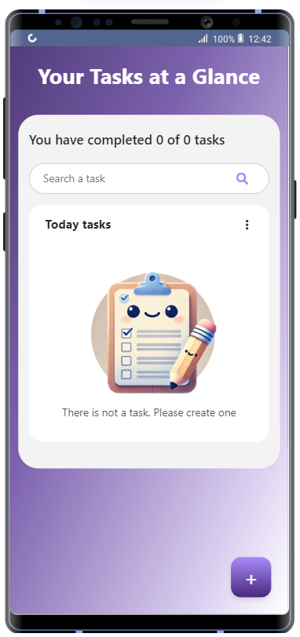
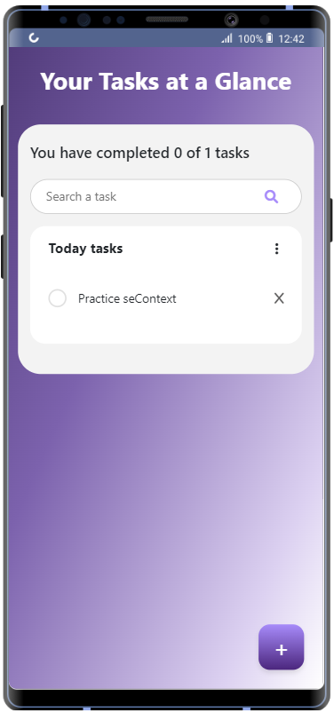
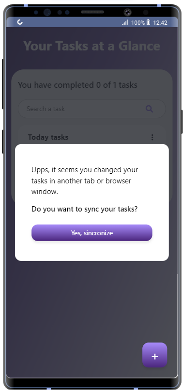

# React + Vite: To-Do List App

This project is a to-do list application built with **React** and configured with **Vite**. While its functionality is basic, the main purpose of this app is to practice, review, and deepen knowledge of advanced React concepts, rendering patterns, and component design.

## Project Goals

The primary goal of this project is to enhance understanding and apply professional principles in state management and component composition in React. Additionally, it aims to explore both fundamental and advanced concepts critical to modern React development.

---

## Concepts Implemented

This project demonstrates the use of several key React patterns and principles:

1. **Rendering Patterns:**

   - Declarative design philosophy.
   - Optimizing user experience through efficient rendering.

2. **React Design Philosophy and Principles:**

   - Maintaining a clear and modular component hierarchy.
   - Promoting component reusability.

3. **Component Composition and State Management:**

   - Organizing state in the most appropriate location depending on its context.
   - Logical separation of responsibilities within the app.

4. **React Context:**

   - Using the Context API to share state and logic between components without "prop drilling."

5. **Custom Hooks:**

   - Creating custom hooks to encapsulate reusable logic.

6. **Render Props and Render Functions:**

   - Implementing advanced patterns to share functionality between components.

7. **React.Children and React.cloneElement:**

   - Leveraging advanced React utilities to dynamically work with child components.

8. **High Order Components (HOCs):**

   - Using HOCs to add functionality to other components.

9. **useReducer:**
   - Implementing `useReducer` for managing complex state in the application.

---

## App Features

- **Modern and Intuitive Interface:**
  The user interface is designed to be simple and user-friendly, with a clean, responsive design.

- **Task Synchronization:**
  Detects changes made to tasks in another tab or browser window and displays a dialog to synchronize the data.

- **Basic To-Do List Functionality:**
  - Add, delete, and search for tasks.
  - Progress indicator showing completed tasks.

---

## Technologies Used

- **React**: Library for building the user interface.
- **Vite**: Development tool for a fast and lightweight environment.
- **Modern CSS**: Responsive and visually appealing design.

---

## App Previews

### Initial Screen



### Tasks in Progress



### Task Synchronization



---

## Installation and Usage

1.  Clone this repository:

    ```bash
    git clone https://github.com/your-repo/to-do-list-app.git
    ```
2. Clone this repository:

    ```bash
    npm install
    ```

3. Start the development server:

    ```bash
    npm run dev
    ```
